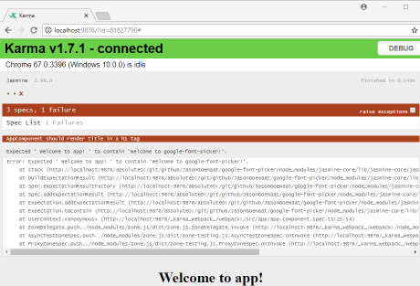

# Creating the app

This is where I log what I did to create the app and the issues I may have
had and what I did to get around them.

## First steps

### Use Node 8.9 or later

[nvm-windows](https://github.com/coreybutler/nvm-windows) lets you use
different node versions on your computer (one at a time) without reinstalling
node.

Basically you should be able to type these commands:

    nvm install 8.11.3
    nvm use 8.11.3

And you *should* be setup to use Node 8.11.3. 

**NOTE** 

*@angular/cli requires version 8.9 or greater of node, and nvm had a problem
with it!*

I had to manually download Node 8.11.3 and unpack it into the folder
`C:\Users\Jason\AppData\Roaming\nvm\v8.11.3`.  Then I think nvm picked up
that I had the version available and I could use `nvm use 8.11.3`.  This
is weird because `nvm list avaialble` shows those versions, but none of
the 8.9 or later versions would install for me.  I just get an error like this:

    $ nvm install 8.11.2
    Node.js v8.11.2 is not yet released or available.

### Install @angular/cli globally

[@angular/cli](https://github.com/angular/angular-cli) gives you the commands
to create and run your angular projects.  To install it globally in the
version of node you are using:

    npm install -g @angular/cli

This installed Angular CLI 6.0.8 for me, with angular version 6.0.7.

### CLI configuration

I like using [yarn](https://yarnpkg.com/lang/en/) for a package manager,
so I installed yarn and configured the CLI to use it.

    npm install -g yarn
    ng config -g cli.packageManager yarn

### Created the project

Then to create my project I typed:

    ng new google-font-picker --style=scss

The option `--style=scss` will make the global stylesheet and components
generated for the project use sass with the file extension scss instead
of plain css.

>**NOTE**
>
>*If you omit this and need to change it later, you'll have to change all of
your `.css` files to `.scss`, change the urls in your components, change
`angular.json` in two places to use the root `styles.scss` you renamed, and
run this command:*
>
>`ng config schematics.@schematics/angular:component.styleext scss`

I waited a few minutes for it to complete, then changed to the directory,
ran visual studio code to open that directory, and started the dev server
on port 4200:

    cd google-font-picker
    code .
    npm start

Now I could go to http://localhost:4200 in my browser and see it running.

### Running tests

The cli creates basic tests for us, so I ran `ng test`.  It takes a minute
to build and opens up a browser window with Karma displayed.  It looks like
the CLI gave us a failed test to start with!

It looks like the app component has the default title of 'app' and one of
the tests expects the field to have that value, but another test expects
the h1 tag to render the titale we gave it.  I fixed the first test to
expect the title field to be google-font-picker as well and got 2 failures
as expected.  Then I changed the title to be that and got green lights.

I created the second commit and created this repository on github: [git@github.com:JasonGoemaat/google-font-picker.git](git@github.com:JasonGoemaat/google-font-picker.git)

I added the MIT `LICENSE` file and am about to commit and push...

# Server-Side Rendering

[This article](https://hackernoon.com/deploying-angular-universal-v6-with-firebase-c86381ddd445) is pretty good for it.

First I install the firebase-tools:

    npm install -g firebase-tools

Hmmm...  Seems to include making it Angular Universal with 
Server Side Rendering, I'll try it...  For othat I need
`@angular/platform-server`:

    npm install --save @angular/platform-server

For adding server side config, we need to add a `server` section
under `projects.PROJECT_NAME.architect`:

    "server": {
        "builder": "@angular-devkit/build-angular:server",
        "options": {
            "outputPath": "functions/dist/server",
            "main": "src/main-ssr.ts",
            "tsConfig": "src/tsconfig.app-ssr.json"
        }
    }

And they want me to modify output to the `functions/dist/browser`
folder?  Hmmm...  We'll see how this goes.  This is
`architect.build.options.outputPath` in `angular.json`

Now we need a modules for the server version:
`src/app/app.server.module.ts`.

And an entry point for the server module: `src/main-ssr.ts`.

And a tsconfig file for ssr: `src/tsconfig.app-ssr.json`.

Now include a transition in the app's browser module, by adding
`.withServerTransition` to the BrowserModule import.

    BrowserModule.withServerTransition({ appId: APP_ID })

Now build production and an 'ng run' command to build the
server version of the app:

    ng build --prod
    ng run google-font-picker:server

Well, that all builds even though I'm using a fake app id.  Not on to actually adding firebase (after a quick commit)...

# Firebase

Enter `firebase login`.  This should open an OAUTH login in your
browser.

Enter `firebase init` to initialize firebase in your project. 
This will ask you several questions:

* 'Y'es (or ENTER) "Are you ready to proceed?"
* Pick options, definitely 'Functions' and 'Hosting', I'm picking all...
* And I pick to create a new project, naming it google-font-picker
* Default options for everything, including (per the article) 'JavaScript' instead of 'TypeScript' for simplicity
* I don't think 'public' is the right directory, but it says
* I DID change the option to make it a SPA, rewriting everything to index.html

Now have to edit `firebase.json` to tell it to use the ssr function
for server side rendering.

Finally after build you need to copy all from `functions/dist/browser`
to `public`, and rename index.html to index2.html because ssr won't
be used if it finds index.html?

    cp -a functions/dist/browser/. public/
    mv public/index.html public/index2.html

And (crossing fingers):

    firebase deploy

I had to remove the lint step from `functions.predeploy` in
`firebase.json`.  Then I had to go to the firbase console and
create a database.

Hmm..  Going to site it didn't find `index.html`, so ssr isn't being
called when requesting the root.  I added `index.html` back in and it
worked, but no SSR.  I refreshed the page and all I saw in the response
in the dev tools was the normal index.html.  So I'm trying removing
this from `hosting.rewrites` in `firebase.json` and removing index.html
again (it should still be index2.html):

    {
        "source": "**",
        "destination": "/index.html"
    }

Ok, now getting 404 again.  I think I missed actually adding a function.  Yes,  I see now there are **2 PARTS**.  I skipped some steps in part II of [the guide](https://hackernoon.com/deploying-angular-universal-v6-with-firebase-c86381ddd445)

To fix I am following those steps.  I ran this:

    npm install --save firebase-functions

I see they have `firebase-admin too`, so I added this:

    npm install --save firebase-admin

I added these (might also need `express`) to dependencies in
`functions/package.json`:

    "@angular/animations": "^6.0.3",
    "@angular/common": "^6.0.3",
    "@angular/compiler": "^6.0.3",
    "@angular/core": "^6.0.3",
    "@angular/forms": "^6.0.3",
    "@angular/http": "^6.0.3",
    "@angular/platform-browser": "^6.0.3",
    "@angular/platform-browser-dynamic": "^6.0.3",
    "@angular/platform-server": "^6.0.7",
    "@angular/router": "^6.0.3",
    "rxjs": "^6.0.0",
    "zone.js": "^0.8.26",

And ran `npm install` in the functions directory, or you could do this:

    npm --prefix functions install

Now you actually have to create a function to serve the app.  Create
`functions.https.onRequest`.  It will import `AppServerModuleNgFactory`
which was generated in Step I Part 8, and an 'index' variable that gets
the contents of the index.html (renamed index2.html) file.  Use
renderModuleFactory to generate the html file we send as a response
with url and document parameters.  url has the route and document is
the full html of the page returned.  Basically this in 'functions/index.js' ([link to his file on github](https://github.com/aaronte/angular-universal-firebase/blob/master/functions/index.js):

    require('zone.js/dist/zone-node');

    const functions = require('firebase-functions');
    const express = require('express');
    const path = require('path');
    const { enableProdMode } = require('@angular/core');
    const { renderModuleFactory } = require('@angular/platform-server');

    const { AppServerModuleNgFactory } = require('./dist/server/main');

    enableProdMode();

    const index = require('fs')
    .readFileSync(path.resolve(__dirname, './dist/browser/index.html'), 'utf8')
    .toString();

    let app = express();

    app.get('**', function(req, res) {
    renderModuleFactory(AppServerModuleNgFactory, {
        url: req.path,
        document: index
    }).then(html => res.status(200).send(html));
    });

    exports.ssr = functions.https.onRequest(app);

Notice the last line we export `ssr`.  Now we change `firebase.json`
`hosting.rewrites` to use the `ssr` function.  I don't get the first
part sending css and js to index2.html?  Oh well...

Ok, I ***did*** have to add express.  Doing that now:

    npm --prefix functions install express --save

Didn't work for some reason, going into `functions` directory and
executing:

    yarn add express

And back up to run and running:

    firebase deploy --only functions

Well, well, well..  It worked!

Adding this to the bottom of .gitignore:

    # functions stuff and public directory
    /functions/node_modules
    /functions/dist
    /public

And committing :)

Ok, tried a little timeout thing so I could tell when it's loaded.  It took
me a long time until I found [this page](https://github.com/angular/universal/blob/master/docs/gotchas.md) on gotchas
with Angular Universal.  You can inject `PLATFORM_ID` from `@angular/core`
which turns out to be a string, 'browser' if running on the client browser
(or in tests I believe).  There is an `isPlatformBrowser` function in
`@angular/common` you can use to check it though...

    export class AppComponent implements OnInit {
        title = 'Webfont Picker';
        loadingString = 'Loading...';
        loadingColor = 'yellow';

        constructor(@Inject(PLATFORM_ID) private platformId: Object) {
            if (typeof(window) !== 'undefined') window['CAPP'] = this;
        }

        ngOnInit() {
            if (isPlatformBrowser(this.platformId)) {
                setTimeout(() => {
                    this.loadingString = 'Loaded!';
                    setTimeout(() => {
                    this.loadingColor = '#0f0';
                    },1000);
                }, 0);
            }
        }
    }

You can use `fixture.whenStable()` for testing after timers have completed:

    it('should change loading message quickly', async(() => {
      const fixture = TestBed.createComponent(AppComponent);
      fixture.detectChanges();

      fixture.whenStable().then(() => {
        fixture.detectChanges();
        const compiled = fixture.debugElement.nativeElement;
        expect(compiled.querySelector('h2').textContent).toContain('Loaded!');
        expect(compiled.querySelector('h2').style.backgroundColor).toEqual('rgb(0, 255, 0)');
      });
    }));

Ok, I'm going to commit 'SSR Fixes', all tests are passing and I think it's
doing what I want in the browser when I deploy.
